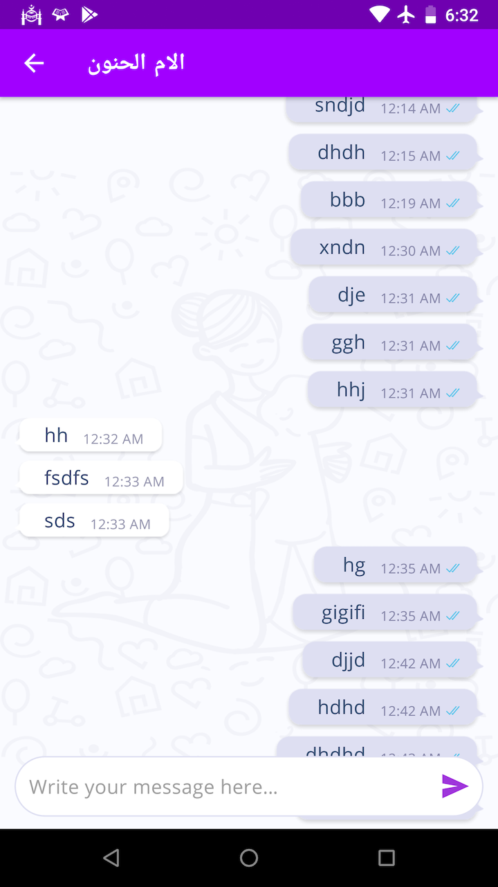

# android-kotlin-samples
This repository contains code samples intended for clients/companies I want to work with. 

It contains some parts of this realtime chat screen.

Basically it is a wrapper on top of SendBird API. It makes use of following

1. LiveData
2. ViewModel
3. Paging Library (with network+DB combined)
4. Kotlin Coroutines